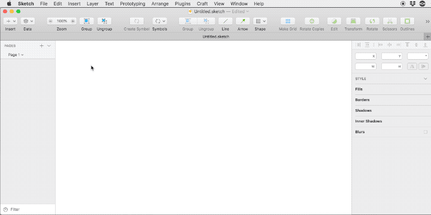

##What is NeuraLorem?
NeuraLorem is a plugin for [Sketch](https://www.sketchapp.com/) for creating Lorem Ipsum fill text.
The plugin creates the text based on input seeds and tries to come up with a contextual useful fill text, instead of the standard Lorem Ipsum fill text.

The neural network is based on [textgenrnn](https://github.com/minimaxir/textgenrnn), a text-generating neural network.

Why write such a plugin?
The plugin was written in the *machine learning for designers* workshop at [@hfggmuend](https://www.hfg-gmuend.de/), led by [@philippschmitt](https://philippschmitt.com/). It's a small dive into machine learning and what could be possible use cases for designers.

##How to run the plugin?

1. [Install tensorflow](https://www.tensorflow.org/install) via python.
2. If installed in a virtual environment via anaconda -> Run the virtual environment. (My environment is called `tensorflow-env`)

**Useful commands copied from the install page of tensorflow:**

*  Create a new virtual environment by choosing a Python interpreter and making a ./venv directory to hold it: `conda create -n venv pip python=3.6`
*	Activate the virtual environment: `conda activate tensorflow-env `
*	Within the virtual environment, install the TensorFlow pip package using its complete URL:	`pip install --ignore-installed --upgrade packageURL`
* 	And to exit virtualenv later: `conda deactivate` + `source deactivate`
Don't exit until you're done using TensorFlow

4. Run the node script. `node server.js`
	The script creates a server, listening on port 3000 for incoming seeds.
5. Now you're sketch plugin can connect to the machine learning model and generate the text.